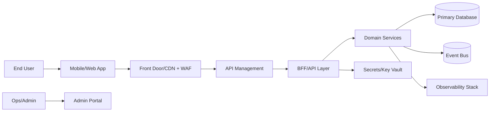
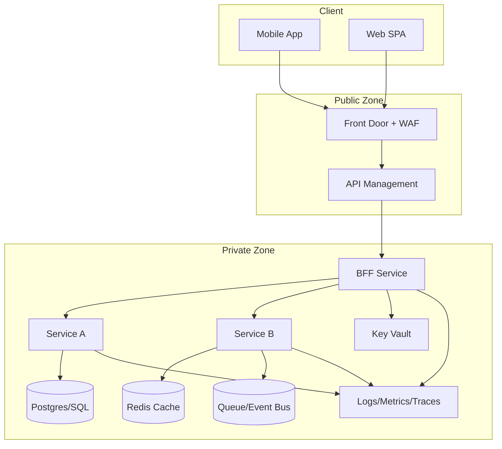

# Architecture Overview

## 1) C4 Context Diagram

## 2) C4 Container Diagram

## 3) Trust Boundaries
- Boundary A: Public internet to edge (WAF enforced)
- Boundary B: Edge to API layer (authenticated traffic only)
- Boundary C: App services to data plane (private networking only)

## 4) Data Stores and Rationale
- Primary relational DB: transactional consistency
- Cache: low-latency reads
- Event bus: async workflows and resilience

## 5) Integration Points
- Identity provider (OIDC)
- Payment/provider APIs
- Messaging/notification provider
