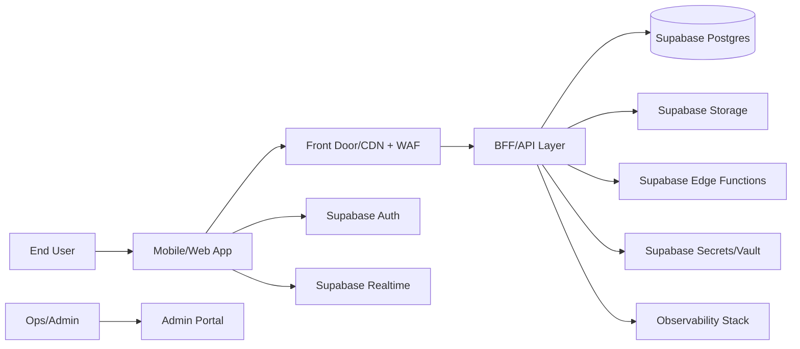
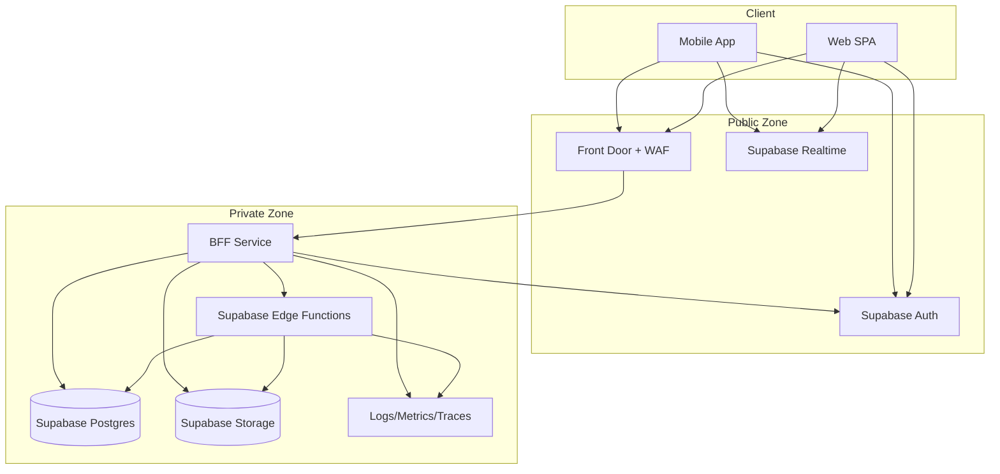

# Architecture Overview

## 1) C4 Context Diagram (Supabase-Centric)

## 2) C4 Container Diagram

## 3) Trust Boundaries
- Boundary A: Public internet to edge/auth/realtime endpoints.
- Boundary B: Edge to BFF/Edge functions with strict key isolation.
- Boundary C: Data plane (Postgres + Storage) with RLS and private bucket controls.

## 4) Data Stores and Rationale
- Supabase Postgres: primary relational store with RLS.
- Supabase Storage: secure object storage with signed URL access.
- Realtime: low-latency state/event propagation from Postgres changes.

## 5) Integration Points
- Supabase Auth (OIDC, PKCE, MFA)
- Supabase Edge Functions for event/webhook automation
- External providers (payments, notifications, messaging)

## 6) Companion Document
For deep integration patterns by capability, see `docs/SUPABASE_ARCHITECTURE.md`.
