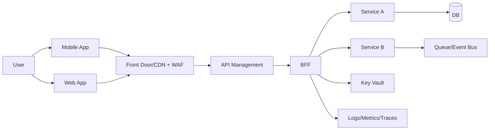
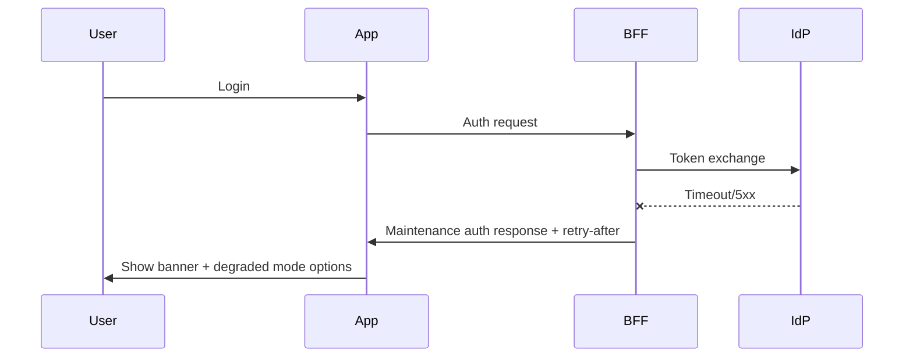

# Diagram Prompts and Reusable Mermaid

## Prompt 1: C4 Architecture
Create C4 Context + Container for mobile+web on Azure with Front Door/WAF, APIM, BFF, services, DB, Key Vault, observability. Show trust boundaries.

## Prompt 2: CI/CD
Design Azure DevOps CI/CD for mobile (sign + TestFlight/Play internal), web, backend with security gates, SBOM, approvals, staged rollout, rollback criteria.

## Prompt 3: Threat Model
STRIDE threat model for token theft, rooted devices, MITM, API abuse, PII leakage, supply chain. Output mitigations + test cases.

## Prompt 4: Failure Modes
Failure-mode diagrams: IdP outage, region outage, DB failover, queue backlog, third-party outage. Include user-facing behavior.

## Mermaid: High-level Architecture


## Mermaid: CI/CD Overview
```mermaid
flowchart TD
  PR[PR/Commit] --> CI[Build + Unit Tests]
  CI --> SEC[SAST + Dependency + SBOM]
  SEC --> PKG[Package Artifacts]
  PKG --> DEV[Deploy Dev]
  DEV --> QA[Deploy QA + Smoke]
  QA --> PRE[Deploy PreProd + Perf]
  PRE --> PROD[Prod Release (Phased)]
  PROD --> MON[Release Health + Alerts]
```

## Mermaid: Failure Mode (IdP Outage)

