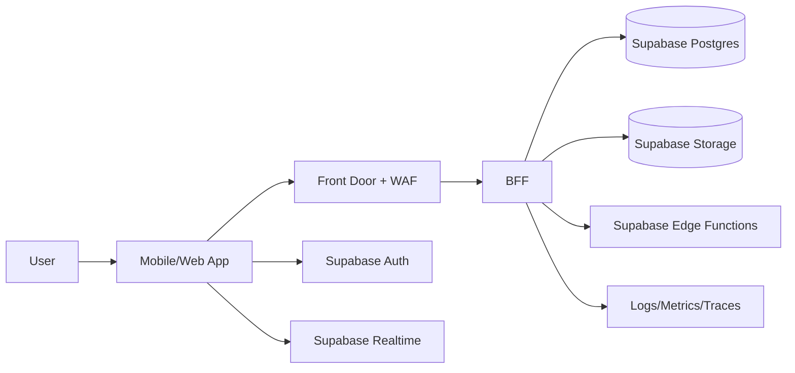
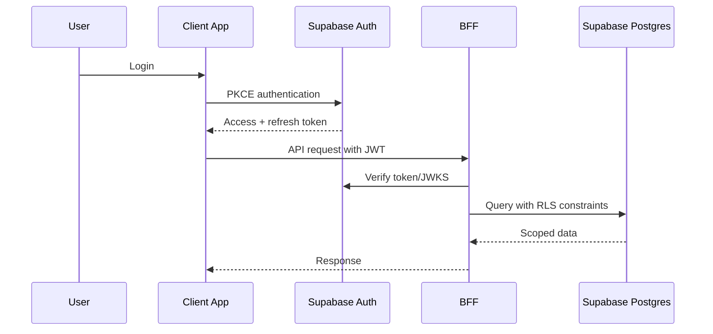
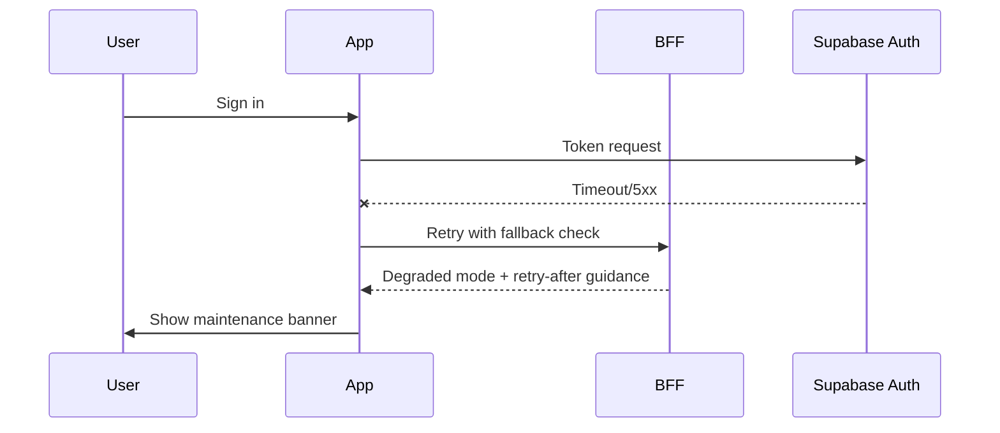

# Diagram Prompts and Reusable Mermaid (Supabase Edition)

## Prompt 1: Full Supabase Architecture
Create C4 Context + Container for mobile+web on Azure edge with Supabase Auth, Postgres, Storage, Realtime, Edge Functions, and trust boundaries. Include BFF and observability.

## Prompt 2: CI/CD with Supabase Gates
Design Azure DevOps CI/CD for mobile/web/backend + Supabase migrations with SQL linting, RLS policy tests, SBOM, approvals, staged rollout, and rollback criteria.

## Prompt 3: Supabase Threat Model
Create STRIDE threat model for token theft, weak RLS policies, storage object leakage, API abuse, PII leakage, and supply chain risk. Include mitigations and test cases.

## Prompt 4: Supabase Failure Modes
Create failure-mode diagrams for Auth outage, Postgres saturation, Storage signing failures, Realtime disconnect storms, and Edge Function provider outages.

## Mermaid: Supabase High-level Architecture


## Mermaid: Supabase Auth + API Flow


## Mermaid: CI/CD Overview with Supabase Gates
```mermaid
flowchart TD
  PR[PR/Commit] --> CI[Build + Unit Tests]
  CI --> SEC[SAST + Dependency + SBOM]
  SEC --> SQL[Supabase Migration Validate + SQL Lint]
  SQL --> RLS[RLS Policy Tests]
  RLS --> DEV[Deploy Dev]
  DEV --> QA[Deploy QA + Smoke]
  QA --> PRE[Deploy PreProd + Perf]
  PRE --> PROD[Prod Release (Phased)]
  PROD --> MON[Release Health + Alerts]
```

## Mermaid: Failure Mode (Supabase Auth Outage)

