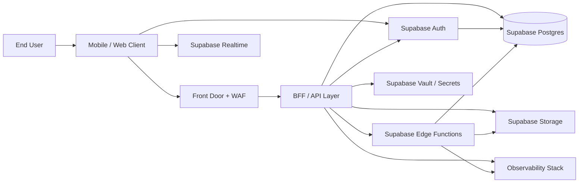
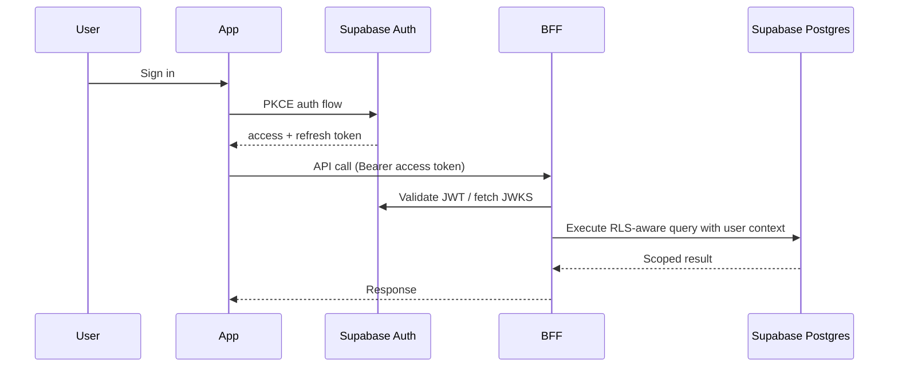
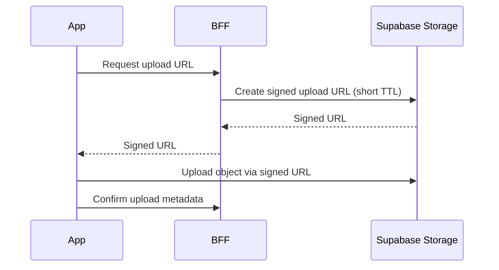
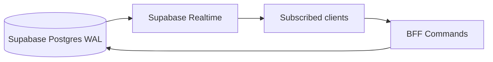
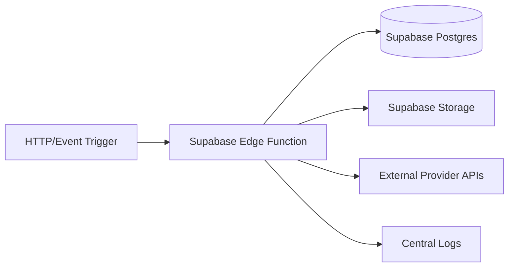

# Supabase Architecture (Secure + Robust)

This document defines a production-grade integration model for using **Supabase Auth, Postgres, Storage, Realtime, Edge Functions, and Vault** with mobile/web apps and backend services.

## 1) Integration Principles
- Use Supabase as the primary BaaS for auth, relational data, object storage, and realtime.
- Keep all privileged operations server-side using service-role key only in backend/edge runtime.
- Enforce Row Level Security (RLS) on every exposed table and use least-privilege SQL policies.
- Separate environments by project (`dev`, `qa`, `preprod`, `prod`) with isolated keys and storage buckets.
- Use signed URLs and short TTLs for private object access.

## 2) Reference Architecture (End-to-End)


## 3) Auth Integration (OIDC + PKCE)


### Security Controls
- PKCE required for public clients.
- JWT expiry short (for example 15–30 min) + rotating refresh tokens.
- MFA for privileged roles.
- Server enforces role claims; clients never self-assert role.

## 4) Database + RLS Integration
```mermaid
flowchart TB
  Client[Client JWT] --> API[BFF]
  API --> PG[(Supabase Postgres)]

  subgraph SQL Security
    T1[Tables]
    P1[RLS Enabled]
    P2[Policy: user_id = auth.uid()]
    P3[Policy: role-based admin access]
  end

  PG --> T1 --> P1 --> P2 --> P3
```

### Hard Requirements
- RLS enabled on all public schema tables.
- No direct table access for anonymous role unless explicitly required.
- Policy tests included in CI (allow + deny cases).
- Idempotency key pattern for write endpoints (orders/payments).

## 5) Storage Integration (Private by Default)


### Security Controls
- Buckets private by default.
- Use path conventions (`tenant_id/user_id/object`) and validate path ownership.
- Antivirus/content checks in post-upload workflow for sensitive pipelines.

## 6) Realtime Integration


### Reliability Controls
- Broadcast only non-sensitive event payloads.
- Reconnect strategy with exponential backoff.
- Client-side deduplication and version checks.

## 7) Edge Functions Integration


### Security Controls
- Secrets from Supabase-managed environment/vault only.
- Input validation and schema enforcement for all entry points.
- Circuit breaker + retries with timeout budgets for third-party calls.

## 8) Network and Trust Boundaries
- Public boundary: clients to edge and auth endpoints.
- Private boundary: BFF and edge functions handling privileged keys.
- Data boundary: Postgres and Storage with least-privilege access.

## 9) Operational Checklist
- [ ] Auth token lifetime and rotation policy documented.
- [ ] RLS + policy test suite enforced in CI.
- [ ] Bucket classification and retention documented.
- [ ] Database PITR and restore runbook validated quarterly.
- [ ] Alerts on auth failures, DB saturation, storage anomalies, and edge function errors.
